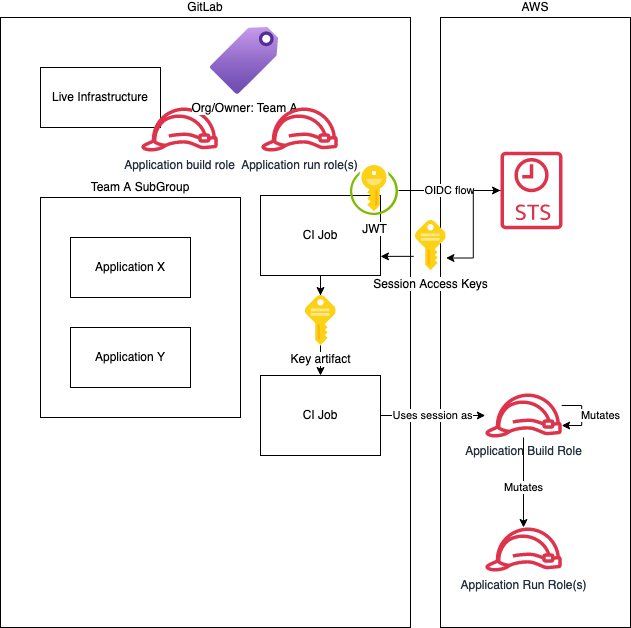

+++
title = "GitLab and AWS IAM Permissions"
date = 2023-10-13T14:19:04+10:00
description = "Allowing dynamic, independent iteration without giving security an aneurysm"
[taxonomies]
categories = [ "Technical" ]
tags = [ "gitlab", "aws", "iam", "infosec", "access", "iac", "terraform", "cloud", "oidc" ]
+++

# GitLab and AWS IAM Permissions

## Problem

Staff should own their IaC.
To deploy and run an application full-stack 0-to-100 requires IAM permissions.
Those permissions can be difficult to predict and debug.
Granting staff IAM permissions can create large security holes.

## Solution

### High Level Flow

1. Teams can work freely with IAM resources in designated _Sandbox_ Accounts
1. Periodially, the _Sandbox_ account's IAM resources are cleared out
1. The team decides they wish to progress to higher environments
1. The _Platform Engineering_ team provision minimum two (2) accounts.
1. The team is now able to run GitLab CI jobs that have permissions in AWS to do what they need.
   The team is now free to iterate independently.



### Details

GitLab is registered to each AWS Account as an OIDC IdP.
This causes AWS to trust signed attestations from GitLab.
GitLab creates a JWT for each job, that contains the context of the job, signed.
AWS now accepts this and allows for authentication by this means.

The token contains an audience and subject portion.
The audience bit is just to match/identify at a high level.
The subject bit is outside of job control and is how we will scope/segregate permissions.

When we create an application role we set the trust relationship policy to restrict based on subject pathing.
This limits the JWTs and therefore which project's jobs can assume the role.
This is superior to assuming roles using a central account.
Using centralized access keys means that any job could assume any role.
Even if we put some kind of tag/assumption limitation, it would still be manipulable client-side at request time.
The OIDC approach does away with Access Keys entirely.

The IAM roles are tagged with the mandatory `Org/Owner` tag.
This tag is used as a _control tag_ for what is effectively ABAC.
The result is IAM _swim lanes_.
Where free practice is allowed, so long as you don't interfere with other IAM users.

The _swim lanes_ are enforced by Service Control Policy.
The SCP will reject any IAM calls where the requester's ownership tag does not match the target resource's ownership tag.
The SCP does not apply to SSO users, or resources owned by Platform Engineering.

We gate the creation of these service accounts in a `Live Infrastructure` repository.
There, we use a Terraform module to enforce a few important things on the application roles.
A) Populated, matching control tags
B) Build permissions with `IAMFullAccess`
C) Run permissions boundary of PowerUser

## FAQ

### Iterating via GitLab CI is slow/painful/annoying

General staff access to higher environments should be sufficient to assume an application's build and run roles.
That allows staff to locally loop, adjusting permissions without having to commit or wait on CI.
Check out [iamlive](https://github.com/iann0036/iamlive) for a handy tool for this.

### What about Access Keys?

Applications should get roles only wherever possible.
If the workload runs in AWS there are usually more secure and native methods of providing access.
EC2 has instance profiles, lambdas have service roles, EKS has IRSA...

### What happens when the control tag changes?

We have the option to make it an array.
Then we can transition between control tag keys.

### This is glorious! Can we manage everything with swim lanes?

This approach only restricts IAM actions.
There's no protection for anything else in the account with this approach.
In our model, we trust the application teams to either not touch resources they shouldn't or limit their policy scope.

You can extend the control tag ABAC approach to other resources, but transitions are tricky.
Creating a new resource means enforcing the control tag on the `aws:RequestTag`, not the `aws:ResourceTag`.
Similarly there's oddities like removing a tag, and losing control of something you actually should have.

### How do staff work in IAM?

The SCP provided only enforce no IAM updates unless the owner tag matches.
It expressly excludes SSO users.

### Is there a use case for shared accounts or accounts modifying other accounts?

Probably.

Do I want to entertain that requirement?

No.

### How do we programatically provision accounts, if IAM is restricted?

IAM resources owned by PlatformEngineering are excluded from the SCP.

### Why are build and run separate?

It's more secure to have minimal roles where possible, especially since the build account needs `IAMFullAccess`.
It's also easier to understand and reason about permissions when it's not a huge pile.

## Appendix

### SCP

```hcl
data "aws_iam_policy_document" "root_scp" {
  # Enforce a permission boundary
  statement {
    sid = "EnforcePermissionBoundaryToAvoidEscalation"
    actions = [
      "iam:AttachUserPolicy",
      "iam:AttachRolePolicy",
      "iam:CreateUser",
      "iam:CreateRole",
      "iam:DeleteUserPolicy",
      "iam:DeleteRolePolicy",
      "iam:DetachUserPolicy",
      "iam:DetachRolePolicy",
      "iam:PutUserPermissionsBoundary",
      "iam:PutRolePermissionsBoundary",
      "iam:PutUserPolicy",
      "iam:PutRolePolicy",
    ]
    effect    = "Deny"
    resources = ["*"]
    condition {
      # See note 1
      variable = "iam:PermissionsBoundary"
      test     = "StringNotEquals"
      # See note 2
      values   = ["arn:aws:iam::aws:policy/PowerUserAccess"]
    }
    # See note 3
  }
  # This is to prevent adding side channel identity providers
  statement {
    sid = "PreventSideChannelIdP"
    actions = [
      "iam:CreateSAMLProvider",
      "iam:CreateOpenIDConnectProvider"
    ]
    effect    = "Deny"
    resources = ["*"]
    # See note 3
  }
  # This prevents abuse in sandbox by creating a legally bounded user, then removing the bounds
  statement {
    sid       = "PreventRemovalOfPermissionBoundaries"
    actions   = ["iam:DeleteUserPermissionsBoundary", "iam:DeleteRolePermissionsBoundary"]
    resources = ["*"]
    effect    = "Deny"
    # See note 3
  }
}
```

**Note 1:** I suspect this could incorporate the PreventRemoval statement if we used IfExists on this condition test

**Note 2:** This _can_ be a company-defined policy, but that's more difficult.
They are editable and exist per-account.
So they would require additional IAM protection and the array would scale out.

**Note 3:** In our context, I excluded SSO Administrative users.
Here, for simplicity I removed such a condition.
I think there's a reasonable argument that having to go via the `root` account to make these changes is safer.

### SSO IAM Policy

```hcl
# Grant IAM as an exception
statement {
    sid = "IAMUnboundInSandbox"
    actions = ["iam:*"]
    resources = ["*"]
    # This limits users to sandbox accounts
    condition {
      variable = "aws:ResourceAccount"
      test     = "StringEquals"
      values = [
        "999999999999", # $AccountAlias
        # Put all sandbox accounts here
      ]
    }
    # This prevents users from setting IAM resources to the specially privileged group
    condition {
      variable = "aws:RequestTag/Org/Owner"
      test     = "StringNotEqualsIgnoreCase"
      values   = ["PlatformEngineering"]
    }
  }
}
```

## References

- [GitLab OIDC AWS documentation](https://docs.gitlab.com/ee/ci/cloud_services/aws/)
- [Work that inspired me](https://www.island.io/blog/the-true-power-of-aws-tags-how-to-use-abac-at-scale)
- [AWS IAM guide on permission boundaries](https://docs.aws.amazon.com/IAM/latest/UserGuide/access_policies_boundaries.html)
